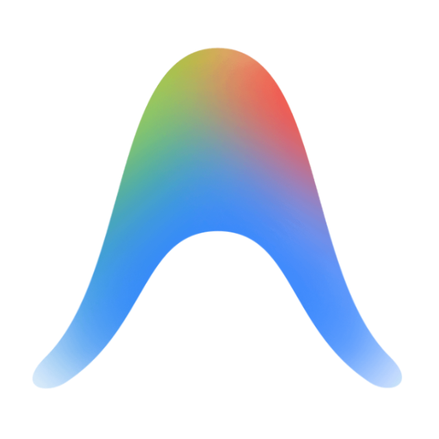
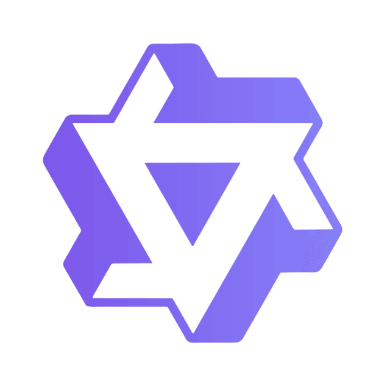
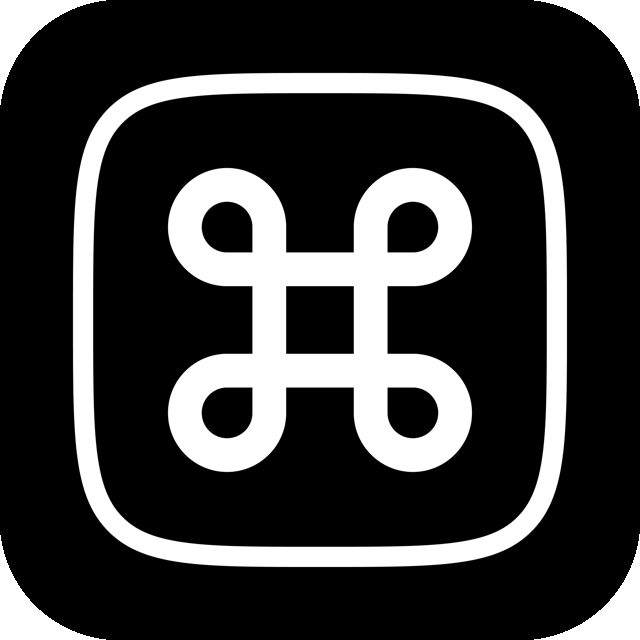
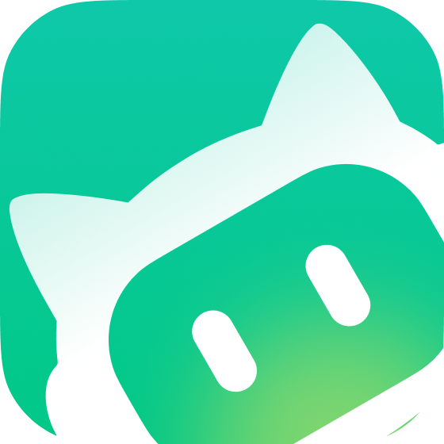
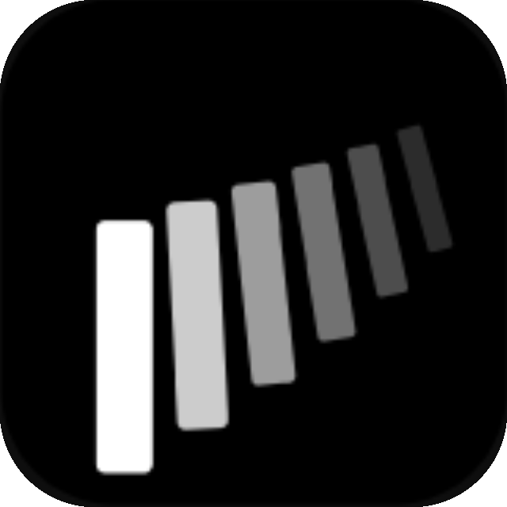

# Token M

Token M is a desktop companion for Codex and other AI coding tools. It tracks local token usage across 30+ AI coding tools, provides a compact Electron dashboard, and can deliver Codex task-completion records and notifications through a WeChat Mini Program.

This repository is a private, early-stage project. It is not presented as a production-grade SaaS.

## Current Notification Architecture

```text
Codex Desktop / CLI
  -> Codex Stop Hook
  -> Token M Desktop
  -> local bridge and completion normalization
  -> durable WeChat outbox
  -> CloudBase HTTPS
  -> tokenm-api
  -> task persistence
  -> WeChat one-time subscription message
  -> Token M WeChat Mini Program
```

The WeChat Mini Program is the only current mobile-notification client. The notification flow does not use QR pairing, a PWA, browser Web Push, or a Cloudflare Worker.

Token M's optional multi-device usage-sync hub remains a separate product feature. It can run locally, as a Node hub, or as the Worker under `worker/`; it is not part of mobile pairing or notification delivery.

## Features

- Codex Stop Hook completion capture
- Durable local notification outbox with retry
- WeChat Mini Program
- Six-digit, single-use pairing codes with expiry and rate limiting
- Multiple desktop bindings per WeChat user
- Task history and pagination
- WeChat one-time subscription notifications and quota tracking
- Minimal privacy mode for notification payloads
- Local token and cost dashboard
- Usage and quota collection for supported AI clients
- Optional multi-device usage sync

Token usage is tracked for Claude Code, Codex, Cursor, GitHub Copilot, Antigravity, OpenCode, and 24+ AI tools. AI Tool Limits cover Claude Code, Codex, Cursor, OpenRouter, third-party APIs, GLM, Kimi, and 19+ providers.

- **WSL usage (Windows)** — file-based usage from running WSL distributions is merged automatically; SQLite-backed tools may require a [headless agent inside WSL](docs/wsl-sqlite-setup.md).

## Supported Tools

Token Monitor supports token usage, account-limit checks, and session details separately:

| Logo | Tool | Data path | Token Usage | AI Tool Limits | Session Details |
|:---:|------|-----------|:---:|:---:|:---:|
|  | Claude Code | `~/.claude/projects/`, `~/.claude/transcripts/` | ✅ | ✅ | ✅ |
|  | Codex | `~/.codex/` | ✅ | ✅ | ✅ |
|  | OpenCode | `~/.local/share/opencode/` | ✅ | ✅ | ✅ |
|  | Hermes Agent | `~/.hermes/state.db` | ✅ | — | — |
|  | OpenClaw | `~/.openclaw/agents/` | ✅ | — | — |
|  | Cursor | local Tokscale cache | ✅ | ✅ | — |
|  | Antigravity | `~/.gemini/` | ✅ | ✅ | — |
|  | Cline | VS Code storage / `~/.cline/` | ✅ | — | — |
|  | Kimi CLI / Kimi Code | `~/.kimi/`, `~/.kimi-code/` | ✅ | ✅ | — |
|  | Qwen CLI | `~/.qwen/projects/` | ✅ | — | — |
|  | Grok Build | `~/.grok/` | ✅ | ✅ | — |
|  | GitHub Copilot | VS Code storage / `~/.copilot/` | ✅ | ✅ | — |
|  | Pi / Oh My Pi | `~/.pi/`, `~/.omp/` | ✅ | — | — |
|  | Zed | local Zed database | ✅ | — | — |
|  | Kilo Code | VS Code storage | ✅ | — | — |
|  | Command Code | `~/.commandcode/projects/` | ✅ | ✅ | — |
|  | MiMo Code | local MiMo database | ✅ | ✅ | — |
|  | ZCode / GLM | `~/.zcode/` | ✅ | ✅ | — |
|  | Kiro | `~/.kiro/` and IDE storage | ✅ | ✅ | — |
|  | CodeBuddy | local project logs | ✅ | — | — |
|  | WorkBuddy | local project logs/database | ✅ | — | — |
|  | Proma | `~/.proma/agent-sessions/` | ✅ | — | — |
|  | Qoder | local Qoder CN database / usage API | ✅ | ✅ | — |
|  | Reasonix | `~/.reasonix/` | ✅ | — | — |
|  | DeepSeek | DeepSeek API key | — | ✅ | — |
|  | OpenRouter | OpenRouter API key (usage/key limit; balance when credits access is authorized, documented for Management keys) | — | ✅ | — |
|  | Minimax | Minimax API key | — | ✅ | — |
|  | Volcengine | Ark API key or AK/SK | — | ✅ | — |
|  | Ollama | Ollama Cloud cookie | — | ✅ | — |
|  | Third-party APIs | New API-compatible and One API presets, plus a declarative Custom balance endpoint | — | ✅ | — |

## Pairing

1. Open the Token M WeChat Mini Program.
2. Generate a six-digit pairing code.
3. Open Token M Desktop and go to WeChat notifications.
4. Enter the code and select **Pair WeChat**.
5. The Desktop calls `POST /v1/desktop/pair`; CloudBase consumes the pairing session once, creates the desktop, and issues its credential.
6. The computer appears in the Mini Program's desktop list.

Pairing codes have a short TTL and cannot be replayed. Desktop credentials are stored locally and are not exposed to the renderer.

## Development

Requirements: Node.js 22.13 or newer.

Desktop:

```bash
npm ci
npm start
```

Run the root verification suite:

```bash
npm run verify
```

The WeChat Mini Program is under `wechat-miniapp/`. Import that directory into WeChat DevTools.

The CloudBase function is under `wechat-miniapp/cloudfunctions/tokenm-api/`:

```bash
cd wechat-miniapp/cloudfunctions/tokenm-api
npm ci
npm test
```

Mini Program contract tests:

```bash
node --test "wechat-miniapp/tests/**/*.test.js"
```

## Configuration

Copy `.env.example` to `.env` for local Desktop/Hub defaults. Do not commit `.env`, private project configuration, runtime credentials, logs, or exported data.

Desktop GUI sections include Collection, AI Tool Limits (provider selection, limits, and credentials), Subscriptions, notifications, and Multi-device Sync. See the [configuration reference](docs/configuration.md) for the full settings and environment-variable surface.

CloudBase deployment templates live in `wechat-miniapp/config/`. The required secret or deployment variable names include:

- `PAIRING_CODE_PEPPER`
- `DEVICE_SECRET_PEPPER`
- `WECHAT_MINIPROGRAM_STATE`
- `WECHAT_SUBSCRIBE_TEMPLATE_ID`
- `WECHAT_TEMPLATE_KEYWORDS` or `WECHAT_TEMPLATE_KEYWORD_MAPPING`
- `WECHAT_HTTP_PUBLIC_ORIGIN`

Tracked examples contain variable names and placeholders only.

## Security and Privacy

- Desktop credentials are verified from server-side hashes; raw credentials are not stored in CloudBase.
- Pairing codes are short-lived, single-use, rate-limited, and stored as derived values.
- Every CloudBase operation enforces tenant ownership.
- Notification quota affects message delivery only. Task persistence continues when quota is zero.
- Minimal privacy mode omits prompt, working directory, conversation, source, and result content.
- Renderer-facing settings redact credentials.

See `docs/wechat-miniapp/SECURITY_MODEL.md` and `docs/wechat-miniapp/PRIVACY.md` for the current notification security model.

## Repository Layout

- `src/electron/` — Desktop shell, Codex Hook bridge, and WeChat notification transport
- `src/shared/` — shared usage, completion, and runtime utilities
- `src/hub/` — optional Node multi-device usage hub
- `worker/` — optional Cloudflare Worker multi-device usage hub only
- `wechat-miniapp/miniprogram/` — WeChat Mini Program
- `wechat-miniapp/cloudfunctions/tokenm-api/` — CloudBase HTTP/API function
- `wechat-miniapp/config/` — deployment examples, database rules, and validation scripts
- `tests/` and `wechat-miniapp/tests/` — Desktop, shared, hub, and WeChat contract tests

## License

MIT
