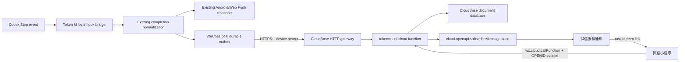

# Token M 微信小程序架构

状态：`FROZEN v1`  
冻结日期：2026-08-18  
冻结责任人：Sol Max Lead

## 1. 架构结论

采用原生微信小程序（WXML/WXSS/JavaScript）+ 微信云开发/CloudBase + Node.js 云函数。新能力放在仓库顶层隔离目录 `wechat-miniapp/`。不引入 Taro、uni-app、React 或 Vue；本功能没有跨端 UI 复用需求，原生方案体积、导入和审核风险最低。

现有 Codex Stop Hook 不复制、不重装。`src/shared/codexCompletion.js` 继续作为 completion identity 的来源；桌面端在现有 bridge 收到一次 Stop 后把同一个 normalized completion fan-out 到现有 Android/Web Push transport 和新的 WeChat transport。任一路线失败不得改变 Codex 任务结果，也不得阻断另一条路线。

参考项目 `aa875982361/codex-task-notifier` 仅用于行为研究。2026-08-18 查询到其 GitHub license metadata 为 `null`，因此不复制其源码。采纳的独立设计思想只有：Stop 触发、隐私最小载荷、稳定 delivery identity、bounded retry、通知失败不影响 Codex。

## 2. 运行时拓扑



## 3. 目录冻结

```text
wechat-miniapp/
  miniprogram/                 原生小程序
    app.js / app.json / app.wxss
    config/runtime.js          空值配置入口，不包含真实凭据
    services/                  cloud function client 与状态映射
    components/                状态、导航、列表等可复用组件
    pages/                     onboarding/dashboard/tasks/task-detail/desktops/pairing/quota/settings/privacy/about
    assets/                    Token M 自有本地图标
  cloudfunctions/
    tokenm-api/                单一部署函数，内部按模块分层
      index.js                 wx.callFunction/HTTP dispatcher
      config.json              openapi permission
      package.json
      lib/                     domain/service/repository/sender/security
  config/                      collection/index/rules/env 模板
  scripts/                     smoke/secret/config validation
  tests/                       contract、integration、UI state fixtures
  project.config.json
  project.private.config.example.json
  README.md
docs/wechat-miniapp/           冻结文档、部署与提交材料
docs/agent-prompts/            Worker 完整 prompt
```

Desktop 生产代码仅新增微信 transport/pairing 模块与现有 runtime 的最小 fan-out 接点；Android `spikes/`、Cloudflare Worker managed notifications 与现有 settings key 不删除、不迁移。

## 4. 组件职责

### Mini Program

- 初始化 `wx.cloud`，调用 `tokenm-api` action。
- 呈现 dashboard、task、desktop、quota、settings、privacy 状态。
- `wx.requestSubscribeMessage` 只在“补充 1 次通知”的 `bindtap` 处理器内直接调用。
- 不接收/保存 OpenID，不直写 quota、desktop、task 或 delivery。
- 使用 cursor pagination；任务详情以服务端 ownership 校验后的 `taskId` 获取。

### `tokenm-api` 云函数

- 每次小程序调用都从 `cloud.getWXContext()` 读取 OPENID/APPID，解析内部 owner。
- Desktop HTTP 路由验证 method、content-type、body size、schema、rate limit 和 bearer credential。
- 执行 user bootstrap、pairing、task persistence、idempotency、quota reservation、delivery、query、settings、delete、cleanup。
- 生产 sender 使用 `cloud.openapi.subscribeMessage.send`；测试 sender 只能通过依赖注入启用，生产入口拒绝 `MOCK_SENDER=true`。

### Desktop transport

- 配对成功后把完整 bearer 保存到已有 private credential store；renderer 只看到布尔/短状态，不看到 secret。
- completion 先进入本地 durable outbox，然后异步 HTTPS POST；timeout 5 秒，指数退避+抖动，最大 15 分钟，credential/validation 错误挂起。
- Event ID 沿用现有稳定 hash identity；同 event 在本地 outbox 与服务端都幂等。
- 默认 privacy mode。Full mode 是显式设置；payload builder 用 allowlist，而不是删除黑名单字段。

## 5. 核心时序

### 5.1 用户启动

1. `wx.cloud.init`。
2. 调用 `bootstrap`；云函数用 OPENID 找到/创建 `users` 与 `notificationState`。
3. 返回不含 OpenID 的 public profile、quota、today count、desktop 摘要、recent tasks。
4. 无 desktop 时显示 onboarding；有 desktop 时显示 dashboard。

### 5.2 配对

1. 小程序调用 `createPairingCode`。
2. 服务端生成 CSPRNG 均匀 6 位数字，使用 HMAC pepper 形成可查 doc id，TTL 10 分钟；同用户旧 active session 失效。
3. 小程序显示 code、过期时间和倒计时。
4. Desktop 对固定 `/v1/desktop/pair` POST `{code, deviceName}`。
5. 服务端先执行全局/IP 指纹 limiter，再在事务中验证 active/TTL/attempts/ownership，创建 desktop，签发 32-byte secret，保存 HMAC hash，消费 session。
6. plaintext credential 只在成功响应中出现一次；Desktop 原子保存。错误 code 返回统一 `pairing_invalid`，不泄漏是否存在、owner 或剩余 TTL。

### 5.3 Completion 与通知

1. Stop Hook 只触发一次，normalize 生成 stable `eventId`。
2. WeChat payload builder 按 privacy/full allowlist 构造 schema v1。
3. 本地 outbox 持久化并 POST `/v1/desktop/events`。
4. 服务端认证 desktop 并以 `taskId = hash(desktopId,eventId)` 做幂等事务：先保存 task；notification disabled 或 quota=0 时直接存 `skipped_*`。
5. quota>0 时事务把 `available - 1`、`reserved + 1` 并创建唯一 delivery `claimed`。
6. 事务提交后调用微信 API。成功后第二个事务 `reserved - 1`、`consumed + 1`，task/delivery=`sent`；明确失败则 `reserved - 1`、`available + 1`；调用结果不确定则保留 `unknown` reservation，禁止自动重发，等待 reconciliation。
7. duplicate event 读取原 task/delivery 并返回 `duplicate`；不新建、不再次 claim、不再次 send、不再次扣 quota。

### 5.4 清除与解绑

- `clearTaskHistory` 原子写入 `historyClearedAt`，查询立即排除旧任务，再由函数做 bounded batch physical cleanup。重复调用幂等。
- `unbindDesktop` 在服务端更新 `revokedAt/status` 并删除可验证 secret hash；之后认证立即失败。已保存 task 保留到用户清除/retention cleanup。
- `deleteAccount`（后端能力与隐私文档提供）先 revoke 全部 desktop，再使全部数据不可见并进行分批物理删除；不承诺单次函数执行删除无限量记录。

## 6. 可靠性与幂等语义

- Event persistence 与 message delivery 解耦；任何 quota/delivery 结果都不回滚 task。
- HTTP success 只表示 server 已持久化并返回明确 `created|duplicate`，不是用户看到微信消息。
- Desktop 可安全 retry 408/425/429/5xx/network/timeout；400/401/403/409/413/422 为 terminal/credential 状态。
- 微信 provider 调用采用 at-most-once claim。为防重复消息，provider 调用开始后出现模糊失败不自动重发；这可能牺牲一条通知，但不会让 duplicate 消耗两次。
- 所有 quota mutation 在同一 `notificationState` doc 的服务端事务中完成，冲突重试后重新检查，`available/reserved/consumed` 永不为负。

## 7. 隐私边界

### Privacy（默认）

允许上传：schema/event/eventId/desktopId/opaque sessionId/occurredAt/privacyMode，可选用户设置的匿名 project label。禁止 prompt、conversation、cwd、lastAssistantMessage、summary、source code、turn content、environment dump。

### Full（用户主动开启）

额外允许：project（basename/用户别名）、model、summary/last assistant message（单段、去控制字符、最多 600 字符）、durationMs。仍禁止 prompt 和完整 transcript。服务端再次执行 exact-key validation；未知字段直接拒绝。

## 8. 配置注入

不提交真实值。

- 小程序本地：`miniprogram/config/runtime.js` 的 `cloudBaseEnvId`、`subscribeTemplateId` 初始为空；运行时显示 `configuration_required`。
- `project.private.config.json`：从 example 复制并填真实 AppID，文件被 ignore。
- 云函数 env：`PAIRING_CODE_PEPPER`、`DEVICE_SECRET_PEPPER`、`WECHAT_SUBSCRIBE_TEMPLATE_ID`、template keyword mapping、`WECHAT_MINIPROGRAM_STATE`、retention/rate limits。
- Desktop：`TOKEN_M_WECHAT_API_URL` 可由部署者预配置；GUI advanced field只在缺失时出现。credential 使用 `tokenMWeChatCredential` 独立 key。

## 9. 技术选择与非目标

- 不引入前端框架或 Web-only motion library。
- 不把 AppSecret 放进仓库、客户端或 Desktop。
- 不建立第二套 Codex Hook。
- 不把 Android Receiver 或现有 Web Push 迁移到 CloudBase。
- 不实现 prompt/完整聊天同步、远程控制 Codex、多人共享 desktop 或公共用户注册。
- 不宣称已部署、已审核或已真实发送；真实平台步骤是独立 gate。

## 10. Frozen contract 变更流程

Workers 不得自行修改 `API_CONTRACT.md`、`DATA_MODEL.md` 或 `SECURITY_MODEL.md` 的外部语义。发现问题时在结果中写 `CONTRACT_CHANGE_REQUEST`（问题、建议、影响），由 Lead 修改版本并通知所有受影响 Worker。
